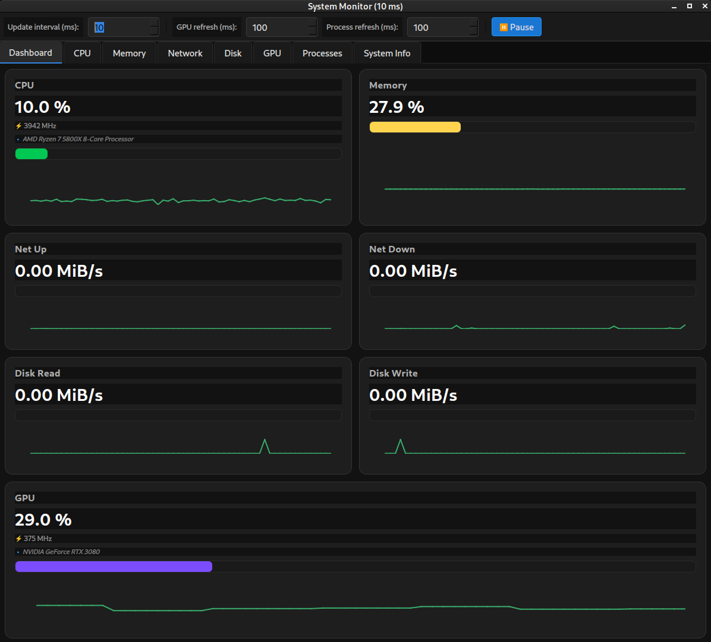
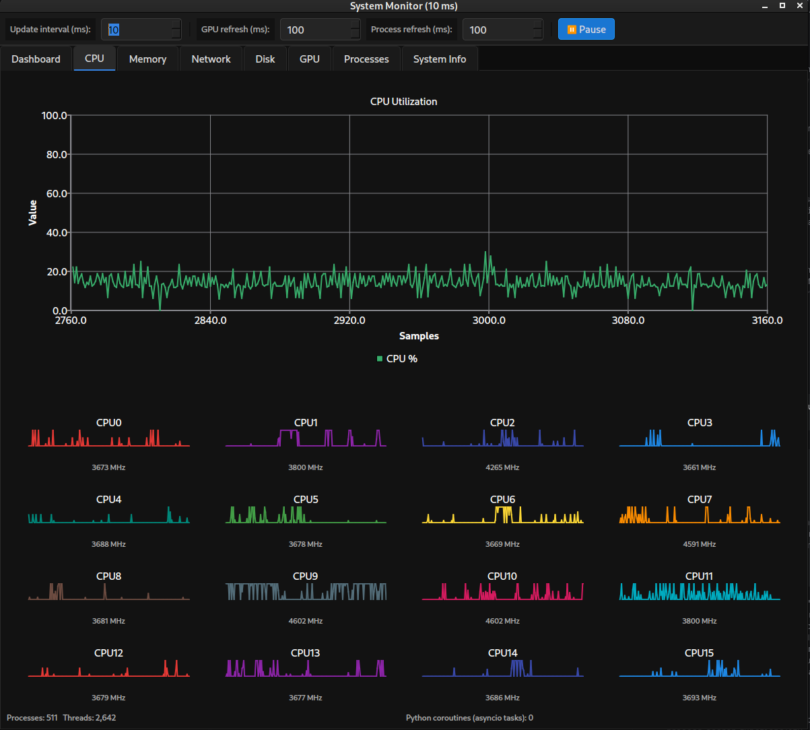
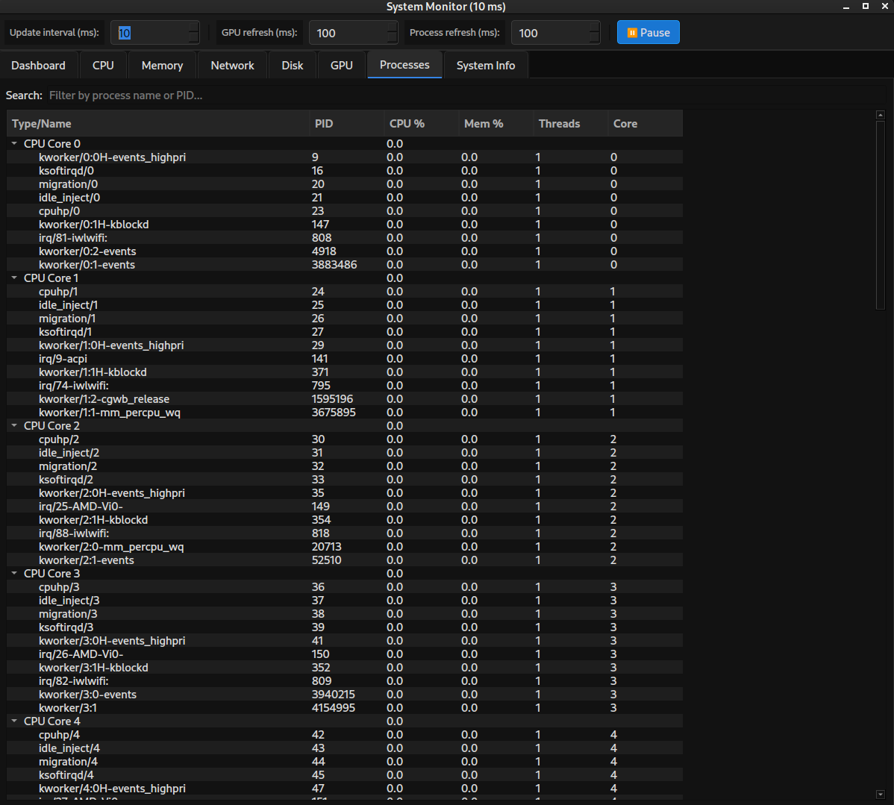

# System Monitor (PySide6)

Fast, elegant, real‑time system monitor for desktop. Built with PySide6 + psutil. Clean dark UI, smooth charts, per‑core CPU, processes view, and optional NVIDIA GPU metrics.

快速、优雅的桌面实时系统监视器。基于 PySide6 与 psutil，深色主题、流畅曲线、按核心显示 CPU、进程视图，并可选支持 NVIDIA GPU 指标。


## Screenshots | 截图






## Features | 功能亮点

- Dashboard cards + time‑series charts for CPU / Memory / Network / Disk / GPU
- Separate per‑core CPU mini‑charts with distinct colors
- Processes tab (PID, Name, CPU%, Mem%, Threads) with adjustable columns
- User‑configurable global update interval (ms) from the toolbar
- Unit switcher for throughput: MB/s or MiB/s (formulas shown in UI)
- Non‑blocking GPU stats via NVML or background `nvidia-smi`

- 总览卡片 + 曲线图，覆盖 CPU / 内存 / 网络 / 磁盘 / GPU
- 按核心分离的 CPU 小图，每个核心不同颜色
- 进程页（PID、名称、CPU%、内存%、线程数），列宽可调整
- 工具栏可配置全局更新间隔（毫秒）
- 网络/磁盘速率单位可切换：MB/s 或 MiB/s（UI 显示换算公式）
- GPU 指标使用 NVML 或后台 `nvidia-smi`，不会阻塞界面


## Install & Run | 安装与运行

- Python 3.9+
- Linux / Windows / macOS 均可（GPU 指标需 NVIDIA 工具；在 macOS/Apple Silicon 上可能不可用）

Install 依赖：

```bash
pip install -r requirements.txt
# Optional (可选，NVML 绑定):
pip install nvidia-ml-py
```

Run 运行：

```bash
python play.py
```


## Usage tips | 使用提示

- Update interval: use the toolbar spin box. Window title shows current ms.
- Units (MB/s vs MiB/s): switch in Network/Disk tabs. Formulas shown in UI:
  - MB/s = bytes/s ÷ 1,000,000
  - MiB/s = bytes/s ÷ 1,048,576
- CPU: per‑core charts live in the CPU tab; summary shows processes/threads and Python asyncio task count.
- Processes: Top by CPU%. Column widths are user‑adjustable.

- 更新间隔：工具栏微调框设置，标题显示当前毫秒值。
- 单位（MB/s 与 MiB/s）：在 网络/磁盘 页切换。UI 内显示换算公式：
  - MB/s = 字节/秒 ÷ 1,000,000
  - MiB/s = 字节/秒 ÷ 1,048,576
- CPU：CPU 页包含每核心小图；底部显示进程/线程与 Python 协程数量。
- 进程：按 CPU% 排序显示前列，列宽可自由调整。


## Contributing | 参与贡献

PRs welcome! Fork → branch → change → PR with a short description.
欢迎提 PR！Fork → 新分支 → 修改 → 提交 PR，并附简要说明。


## License | 许可证

No license specified yet. Open an issue or PR if you need one.
尚未指定许可证，如有需求请提 Issue 或 PR 讨论。
