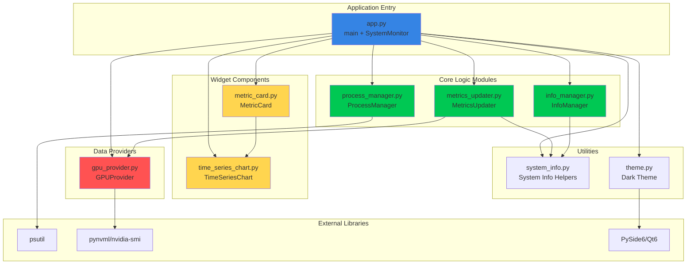
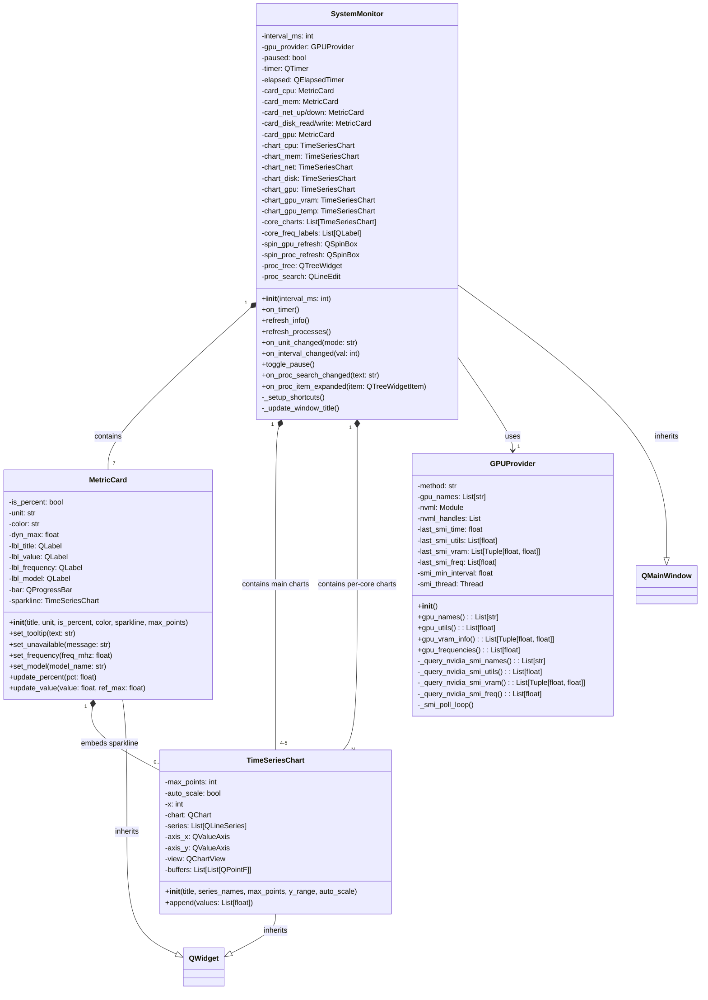
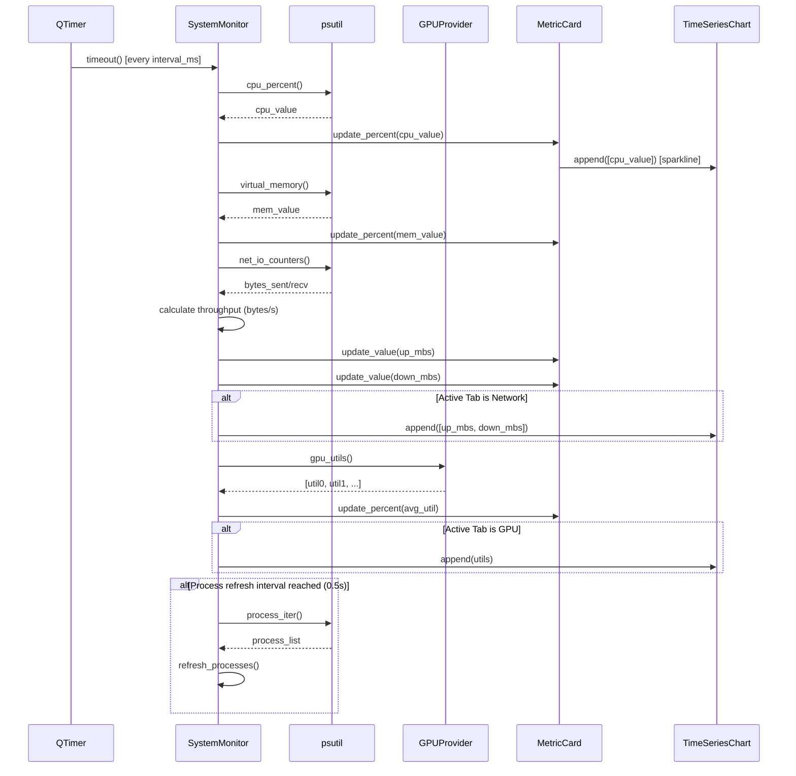
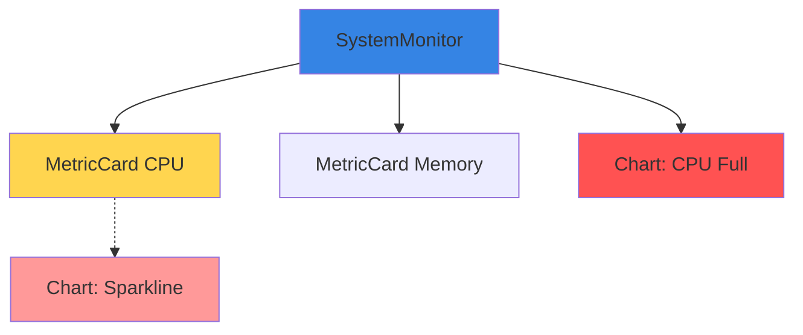
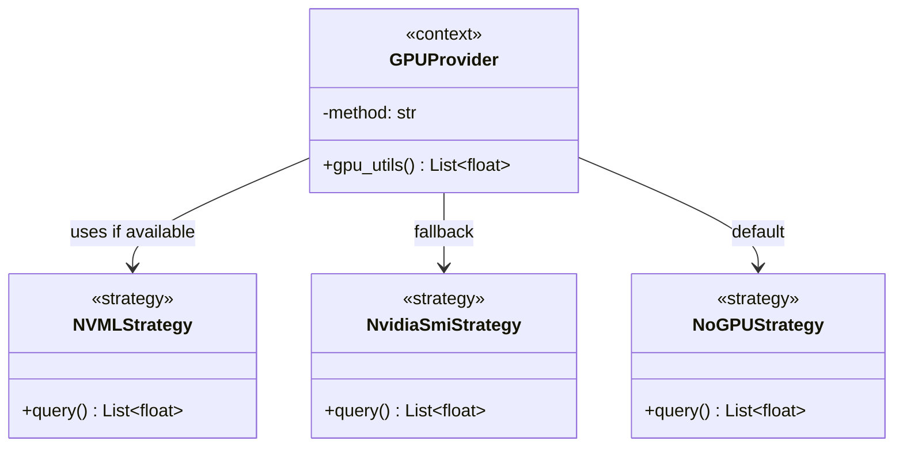
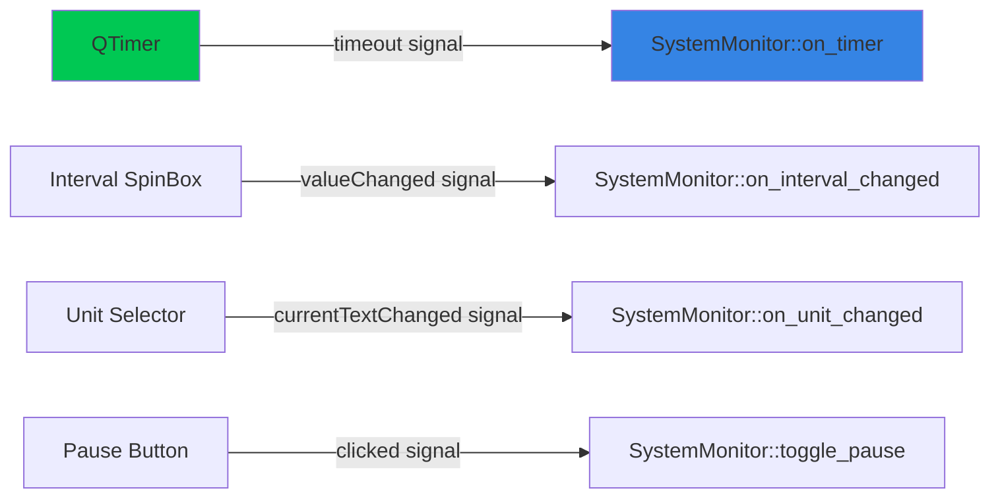

# System Monitor - Architecture Documentation

## Overview

The System Monitor is a real-time desktop application built with PySide6 (Qt6) that provides comprehensive system metrics visualization. The architecture follows a modular, component-based design with clear separation of concerns.

**Tech Stack:**
- **UI Framework:** PySide6 (Qt6)
- **System Metrics:** psutil
- **GPU Metrics:** nvidia-ml-py (NVML) with nvidia-smi fallback
- **Charting:** QtCharts (built-in)

## High-Level Architecture

The application follows a modular architecture with clear separation of concerns:



---

## Class Diagram



---

## Component Details

### 1. SystemMonitor (Main Application Controller)

**Responsibility:** Central orchestrator managing the entire application lifecycle, UI layout, and data updates.

**Key Features:**
- Manages tabbed interface (Dashboard, CPU, Memory, Network, Disk, GPU, Processes, System Info)
- Orchestrates periodic data collection via QTimer (configurable interval, default 100ms)
- Coordinates updates across multiple MetricCard and TimeSeriesChart widgets
- **Pause/resume functionality** with keyboard shortcuts (P = pause/resume, Esc = quit)
- **Configurable refresh rates** for GPU metrics and process table (default 100ms)
- Handles unit conversion (MB/s ↔ MiB/s)
- Uses time-constant decay for dynamic baseline calculation
- **CPU/GPU frequency display** in dashboard cards and tabs
- **CPU/GPU model name display** in dashboard cards
- **Per-core frequency monitoring** with individual labels
- **Memory frequency display** (when available)
- **Hierarchical process tree** (CPU Core → Process → Threads)
- **Process search/filter** by name or PID
- **Lazy thread loading** for performance

**Update Flow:**
```
QTimer.timeout → on_timer() → 
  ├─ Poll psutil for CPU/Memory/Network/Disk
  ├─ Poll GPUProvider for GPU metrics (configurable interval)
  ├─ Update all dashboard MetricCards with frequency info
  ├─ Update active tab's TimeSeriesChart(s)
  ├─ Update per-core frequency labels
  └─ Periodically refresh_processes() (configurable interval)
```

### 2. MetricCard (Dashboard Widget)

**Responsibility:** Self-contained dashboard card displaying a single metric with value, progress bar, and optional sparkline.

**Key Features:**
- Displays title, numeric value with unit, and progress bar
- **Frequency display** (CPU/GPU MHz) with lightning icon
- **Model name display** (CPU/GPU model) with styled label
- Optional embedded sparkline chart (mini TimeSeriesChart)
- Dynamic progress bar coloring (green → orange → red) based on thresholds (80%, 90%)
- Auto-scaling for non-percentage metrics
- Hover effects via CSS styling

**Visual Elements:**
- QLabel (title)
- QLabel (value)
- QLabel (frequency) - optional, hidden when not set
- QLabel (model) - optional, hidden when not set
- QProgressBar (visual indicator with dynamic coloring)
- TimeSeriesChart (optional sparkline, 60 points)

### 3. TimeSeriesChart (Charting Widget)

**Responsibility:** Reusable real-time chart widget for plotting time-series data.

**Key Features:**
- Multi-series support (e.g., Network: Upload + Download)
- Fixed-window rolling buffer (default 400 points)
- Auto-scaling option for dynamic y-axis
- Efficient point management with pre-allocated buffers
- QtCharts integration with antialiasing
- Customizable appearance (axis visibility, legends, margins)

**Performance Optimizations:**
- Uses `QLineSeries.replace()` instead of clearing and re-adding points
- Pre-allocated `QPointF` buffers to reduce allocations
- Only updates charts on active tabs

### 4. GPUProvider (Data Provider)

**Responsibility:** Abstract GPU metrics provider with multiple backend strategies.

**Key Features:**
- **Primary method:** NVML (nvidia-ml-py) for low-latency GPU queries
- **Fallback method:** nvidia-smi subprocess with background polling thread
- Thread-safe caching to prevent UI blocking
- Configurable polling interval (1s for nvidia-smi)
- **GPU utilization** monitoring per device
- **VRAM usage** tracking (used/total MB) per device
- **GPU frequency** monitoring (clock speed in MHz) per device
- **GPU temperature** support via helper functions
- Graceful degradation when no GPU detected

**Strategy Pattern:**
```
1. Try NVML → if success, method = "nvml"
2. Else try nvidia-smi → if success, method = "nvidia-smi" + spawn thread
3. Else method = "none"
```

**Supported Queries:**
- `gpu_names()` - Device names (e.g., "GeForce RTX 3090")
- `gpu_utils()` - Utilization percentages
- `gpu_vram_info()` - (used_mb, total_mb) tuples
- `gpu_frequencies()` - Clock speeds in MHz

---

## Data Flow Diagram



---

## Design Patterns

### 1. **Composite Pattern** (Structural)

**Location:** MetricCard and TimeSeriesChart composition

**Implementation:**
- `MetricCard` can optionally embed a `TimeSeriesChart` (sparkline)
- `SystemMonitor` composes multiple `MetricCard` and `TimeSeriesChart` instances
- Widgets are treated uniformly via Qt's QWidget hierarchy



**Benefits:**
- Reusable chart widgets (both full-size and sparklines)
- Consistent interface for all visual components
- Easy to add new metrics without changing architecture

### 2. **Strategy Pattern** (Behavioral)

**Location:** GPUProvider backend selection

**Implementation:**
```python
class GPUProvider:
    def __init__(self):
        self.method = "none"  # Strategy selector
        
        # Try Strategy 1: NVML
        try:
            import pynvml as nvml
            nvml.nvmlInit()
            self.method = "nvml"
            # ... setup NVML
        except:
            pass
        
        # Try Strategy 2: nvidia-smi
        if self.method == "none" and shutil.which("nvidia-smi"):
            self.method = "nvidia-smi"
            # ... setup subprocess polling
    
    def gpu_utils(self):
        if self.method == "nvml":
            return self._nvml_strategy()
        elif self.method == "nvidia-smi":
            return self._cached_smi_values()
        else:
            return []
```



**Benefits:**
- Runtime selection of GPU query method
- Easy to add new GPU backends (AMD ROCm, Intel)
- Graceful degradation without code duplication

### 3. **Observer Pattern** (Behavioral)

**Location:** Qt Signals/Slots mechanism

**Implementation:**
- QTimer emits `timeout()` signal → `SystemMonitor.on_timer()` slot
- QSpinBox emits `valueChanged()` → `SystemMonitor.on_interval_changed()` slot
- QComboBox emits `currentTextChanged()` → `SystemMonitor.on_unit_changed()` slot
- QPushButton emits `clicked()` → `SystemMonitor.toggle_pause()` slot



**Benefits:**
- Loose coupling between UI controls and business logic
- Event-driven architecture
- Built-in Qt framework support

### 4. **Facade Pattern** (Structural)

**Location:** psutil library usage in SystemMonitor

**Implementation:**
```python
class SystemMonitor:
    def on_timer(self):
        # Facade: simple interface to complex psutil API
        cpu = psutil.cpu_percent()
        mem = psutil.virtual_memory()
        net = psutil.net_io_counters()
        disk = psutil.disk_io_counters()
        # ... simplified access to OS-level metrics
```

**Benefits:**
- SystemMonitor doesn't need to know OS-specific details
- psutil abstracts platform differences (Linux/Windows/macOS)
- Clean, consistent API for system metrics

### 5. **Singleton-like Pattern** (Creational)

**Location:** Global theme application

**Implementation:**
```python
def apply_dark_theme(app: QApplication) -> None:
    """Single, global theme applied once at startup"""
    app.setStyle("Fusion")
    # ... theme configuration
    app.setPalette(palette)
    app.setStyleSheet(...)

def main():
    app = QApplication(sys.argv)
    apply_dark_theme(app)  # Applied once globally
    # ...
```

**Benefits:**
- Consistent theming across entire application
- Single source of truth for visual style
- Applied once at initialization

### 6. **Template Method Pattern** (Behavioral)

**Location:** MetricCard update methods

**Implementation:**
```python
class MetricCard:
    def update_percent(self, pct: float):
        # Template algorithm
        pct_f = self._validate(pct)           # Step 1
        self._set_label(pct_f)                # Step 2
        self._set_progress_bar(pct_f)         # Step 3
        self._apply_warning_colors(pct_f)     # Step 4
        self._update_sparkline(pct_f)         # Step 5
    
    def update_value(self, value: float, ref_max: float):
        # Similar template for non-percentage values
        v = self._validate_value(value)
        self._set_label_with_unit(v)
        self._calculate_percentage(v, ref_max)
        self._set_progress_bar(pct)
        self._update_sparkline(v)
```

**Benefits:**
- Consistent update flow for all metric cards
- Easy to modify behavior at specific steps
- Code reuse between similar operations

---

## Architecture Decisions

### 1. **Why PySide6 over PyQt6?**
- More permissive LGPL license
- Official Qt Company support
- API compatibility with PyQt6

### 2. **Why QtCharts instead of matplotlib/plotly?**
- Native Qt integration (no embedding overhead)
- Better performance for real-time updates
- Consistent theming with Qt widgets
- Lower dependency footprint

### 3. **Why psutil?**
- Cross-platform (Linux/Windows/macOS)
- Pure Python with compiled C extensions
- Comprehensive API (CPU, memory, disk, network, processes)
- Battle-tested and widely used

### 4. **Why background thread for nvidia-smi?**
- nvidia-smi subprocess can take 100-500ms
- Blocking UI thread causes stuttering
- Background polling + caching keeps UI responsive
- NVML (when available) is fast enough for main thread

### 5. **Why separate charts per CPU core?**
- Better scalability for many-core systems
- Individual color coding for quick identification
- Reduces chart complexity (1 series per chart vs N series in 1 chart)
- Scroll area handles overflow gracefully

---

## Performance Considerations

### Update Interval Trade-offs

| Interval | CPU Usage | Smoothness | Use Case |
|----------|-----------|------------|----------|
| 1-10ms   | Very High | Overkill   | Debugging/testing only |
| 50-100ms | Low       | Smooth     | **Recommended default** |
| 200-500ms| Very Low  | Acceptable | Low-power systems |
| 1000ms+  | Minimal   | Choppy     | Background monitoring |

### Chart Optimization

**Current optimizations:**
- Only update charts on active tabs
- Pre-allocated point buffers
- Fixed rolling window (400 points = ~40s @ 100ms)
- Sparklines use smaller buffers (60 points)

**Future possibilities:**
- Adaptive frame rate based on CPU usage
- Level-of-detail rendering (fewer points when zoomed out)
- GPU-accelerated rendering (Qt Quick 2D)

### Memory Usage

**Typical memory footprint:**
- Base application: ~50-80 MB
- Per TimeSeriesChart: ~1-2 MB (400 points)
- Per MetricCard: ~0.5-1 MB (with sparkline)
- Total: ~100-150 MB for typical setup

---

## Extension Points

### Adding New Metrics

1. **Add data collection** in `SystemMonitor.on_timer()`
2. **Create MetricCard** in dashboard grid
3. **(Optional) Create TimeSeriesChart** in new tab
4. **Update card** with collected data

Example:
```python
# 1. Collect
temp = psutil.sensors_temperatures()

# 2. Create card
self.card_temp = MetricCard("CPU Temp", unit="°C", is_percent=False, color="#ff5252")

# 3. Create chart (optional)
self.chart_temp = TimeSeriesChart("Temperature", ["CPU"], y_range=(0, 100))

# 4. Update in on_timer()
self.card_temp.update_value(temp['coretemp'][0].current)
```

### Adding New GPU Backends

Extend `GPUProvider.__init__()`:
```python
# Try AMD ROCm
if self.method == "none" and shutil.which("rocm-smi"):
    self.method = "rocm-smi"
    # ... implement _query_rocm_smi_*() methods
```

### Adding New Tabs

```python
# In SystemMonitor.__init__()
custom_tab = QWidget()
custom_layout = QVBoxLayout(custom_tab)
# ... add widgets
tabs.addTab(custom_tab, "Custom")
```

---

## Testing Strategy

### Unit Testing Targets

- `GPUProvider`: Mock NVML/subprocess
- `TimeSeriesChart.append()`: Verify point buffer management
- `MetricCard.update_percent()`: Verify color thresholds
- Theme application: Verify palette/stylesheet

### Integration Testing

- Full application startup with mocked psutil
- Timer updates with deterministic clock
- Tab switching and chart visibility logic

### Performance Testing

- Measure CPU usage at different update intervals
- Memory leak detection (long-running sessions)
- Chart rendering benchmarks

---

## File Organization

```
python_playground/
├── play.py              # Main application (1051 lines)
│   ├── apply_dark_theme()        # Lines 65-207
│   ├── GPUProvider               # Lines 210-312
│   ├── TimeSeriesChart           # Lines 316-406
│   ├── MetricCard                # Lines 410-506
│   ├── SystemMonitor             # Lines 509-1039
│   └── main()                    # Lines 1042-1047
├── requirements.txt     # Dependencies
├── README.md           # User documentation
├── architecture.md     # This file
└── screenshots/
    ├── main.png
    ├── cpu.png
    └── process.png
```

---

## Conclusion

The System Monitor application demonstrates a clean, maintainable architecture built on proven design patterns. The modular component design allows easy extension, while the layered architecture keeps concerns well-separated. Performance optimizations ensure smooth real-time updates even on resource-constrained systems, and the use of Qt's signal/slot mechanism provides robust event handling.

**Key Strengths:**
✓ Clear separation of concerns (data provider, widgets, controller)  
✓ Reusable components (MetricCard, TimeSeriesChart)  
✓ Graceful degradation (GPU fallbacks)  
✓ Performance-conscious design (tab-aware updates, buffering)  
✓ Extensible architecture (easy to add metrics/backends)  

**Areas for Future Enhancement:**
- Plugin system for custom metrics
- Remote monitoring capabilities
- Data export (CSV, JSON)
- Alert/notification system
- Historical data persistence
